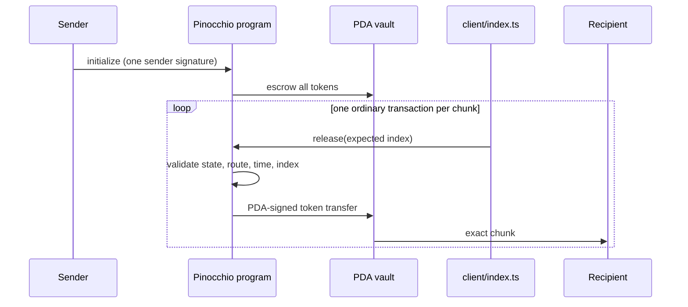
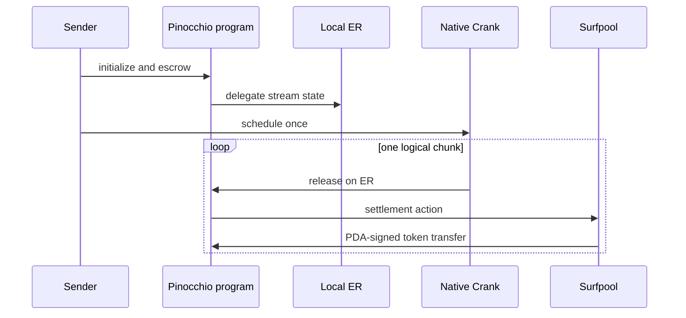

# Solana payment streams

Two local proofs of the same idea:

> A sender signs once to lock tokens into a program-owned vault. Later executions
> transfer fixed chunks to the recipient without another sender signature.

- `native/`: ordinary Surfpool transactions submitted by the `client/` TS client.
- `magicblock/`: a MagicBlock Native Crank running on a local Ephemeral Rollup,
  with settlement back to Surfpool.

There is no separate keeper service or keeper crate. In the native example,
`client/index.ts run` is the keeper: it reads the stream, submits one fresh
transaction per due chunk, and pays that transaction's SOL fee. Anyone can
replace it.

## Layout

```text
solana-payment-streams/
├── README.md
├── magicblock/
│   ├── Cargo.toml
│   ├── package.json
│   ├── tsconfig.json
│   ├── client/{addresses,dlp,wire,state,app,index}.ts
│   ├── program/{Cargo.toml,src/{lib,constants,error,pda,token,validation}.rs,src/state/mod.rs,src/instructions/{mod,initialize,delegate,schedule,release,settle_chunk,finalize,undelegate}.rs}
│   ├── scripts/{setup,start-local,stop-local,demo}.sh
│   └── local MagicBlock/Surfpool configuration
└── native/
    ├── Cargo.toml
    ├── package.json
    ├── tsconfig.json
    ├── client/{state,wire,index}.ts
    ├── program/{Cargo.toml,src/{lib,constants,error,pda,token}.rs,src/state/mod.rs,src/instructions/{mod,initialize,release}.rs}
    ├── local.sh
    └── local Surfpool deployment configuration
```

Each program follows a one-file-per-concern layout: `lib.rs` is only the
entrypoint and instruction dispatch, `constants.rs`/`error.rs`/`pda.rs`/
`token.rs` hold shared wire definitions and
CPI helpers, `state/` holds the account codec, and `instructions/` has one file
per instruction. `client/` is a from-scratch TypeScript client that builds every
instruction directly against that same wire format — no `program-api` crate,
Rust CLI framework, integration-test crate, or separate keeper daemon. Both
programs ship only the instructions load-bearing for the custody proof: neither
has an explicit sender-cancellation path, and native's `finalize` (pure rent
reclaim, no money movement) was dropped too — magicblock keeps its `finalize`
because that instruction is what actually pays out the *final* chunk on natural
completion, not just a cleanup step.

## What prevents redirection?

Neither a keeper nor a crank controls the route. Initialization stores the mint,
recipient token account, vault, total, chunk, and schedule in program state. Each
release re-derives and validates those accounts. The vault is owned by the stream
PDA, so only a successful program instruction can sign the token transfer.

A malicious executor can delay payments by doing nothing. It cannot:

- replace the recipient or mint;
- choose the amount;
- withdraw from the vault;
- execute the same index twice;
- bypass the program's timing or completion checks.

The native release instruction is permissionless, so a different funded runner
can restore liveness. MagicBlock replaces that polling loop with its crank and
settlement runtime; it does not replace the program's custody checks.

## Native flow



Programs do not wake themselves. The native runner is required only to submit
transactions. Every release uses a fresh blockhash and runner signature.

### Run

Requirements: Rust/Solana SBF tools, Surfpool, Node.js, npm, `curl`, and `nc`.

```bash
cd native
./local.sh demo
```

Individual actions:

```bash
./local.sh build
./local.sh start
npm install
npm run setup
npm run init-stream
npm run run
./local.sh stop
```

Configuration is integer-only:

```bash
TOTAL_BASE_UNITS=300000000 CHUNK_BASE_UNITS=100000000 npm run demo
```

The default local mint uses six decimals. The custody model itself is token
agnostic: production code should store and validate the selected mint's decimals
instead of treating the test mint as Circle USDC.

## MagicBlock flow



The extra files under `magicblock/` are runtime inputs, not application layers:
the ER config, two Surfpool runbooks, the fixed local program deployment key, and
the scripts that install/start/stop the official local stack.

```bash
cd magicblock
./scripts/setup.sh
./scripts/start-local.sh
./scripts/demo.sh
./scripts/stop-local.sh
```

## Shared amount example

All values are token base units; neither implementation uses floating point.

```text
six-decimal token
1,000,000 tokens = 1,000,000,000,000 base units
100 tokens       =       100,000,000 base units
iterations       =              10,000
```

Each release transfers `min(remaining, chunk)`. A one-billion-token stream at
100 tokens per chunk means 10,000,000 logical releases. One stream is serial
because every release writes the same state and token accounts; independent
streams can execute in parallel.

## Comparison

| Property | Native | MagicBlock |
| --- | --- | --- |
| Later executor | Replaceable Node runner | Native Crank |
| Execution | Ordinary Surfpool transaction | ER execution plus settlement |
| Sender signs later releases | No | No |
| Executor controls route/amount | No | No |
| Specialized runtime | None | Local ER, DLP, crank, committor |
| Best use | Smallest portable proof | Managed recurring-execution proof |

Generated ledgers, dependencies, keypairs, logs, and build artifacts are ignored.
The earlier expanded implementation remains recoverable in the ignored
`.local-legacy/` directory. Nothing has been pushed to GitHub.
